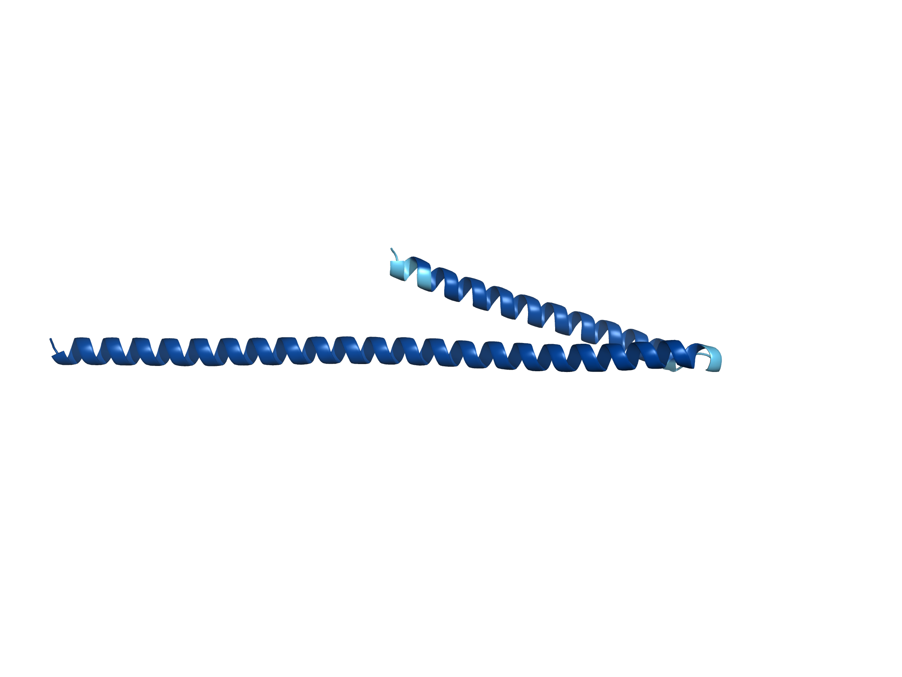
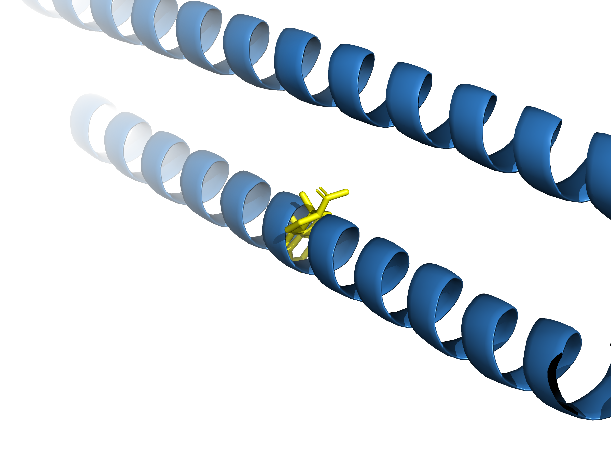

# De Novo Progesterone-Binding Protein Design

**Janghyun Kim** | [jhkwin00@naver.com](mailto:jhkwin00@naver.com) | [jhkwin00@gmail.com](mailto:jhkwin00@gmail.com) | GitHub: [jhkwin00](https://github.com/jhkwin00)

---

## Overview

This project demonstrates a **target-guided de novo protein design** pipeline: starting from a small molecule target (progesterone), designing a de novo protein binder from scratch using RFdiffusionAA → LigandMPNN → ColabFold.

### Connection to the EGFR Project

This project is the second part of a two-project portfolio, designed to tell a coherent story:

> **EGFR Docking Analysis** ([jhkwin00/EGFR-docking-analysis](https://github.com/jhkwin00/EGFR-docking-analysis))
> AutoDock Vina docking of gefitinib against WT and T790M EGFR, followed by ColabFold structure prediction and RMSD 0.682 Å validation against the experimental structure — establishing a structural understanding of how small molecules bind a protein target.
>
> ↓
>
> **Progesterone De Novo Design** ← this project
> Building on that understanding of small molecule–protein interfaces, this project takes the complementary approach: given a small molecule target, a new binding protein is designed from scratch using AI generative models.

---

## Biological Motivation

### Why Progesterone?

Progesterone is a steroid hormone essential for the female reproductive cycle, pregnancy maintenance, and neuroprotection. Several clinical contexts require precise concentration monitoring:

| Clinical Context | Role of Progesterone |
|---|---|
| IVF (In Vitro Fertilization) | Luteal phase support — real-time monitoring required post-ovulation [^1] |
| Preterm birth prevention | Progesterone supplementation reduces recurrent preterm birth risk [^2] |
| Hormone replacement therapy | Co-administered with estradiol; individual dose titration required [^3] |
| Congenital adrenal hyperplasia | 17α-OHP accumulation contaminates progesterone measurements [^4] |

[^1]: van der Linden M et al. Luteal phase support for assisted reproduction cycles. *Cochrane Database Syst Rev.* 2015. [PMID: 26148507](https://pubmed.ncbi.nlm.nih.gov/26148507/)
[^2]: Meis PJ et al. Prevention of recurrent preterm delivery by 17α-hydroxyprogesterone caproate. *N Engl J Med.* 2003;348:2379–2385. [PMID: 12802023](https://pubmed.ncbi.nlm.nih.gov/12802023/)
[^3]: Palacios S et al. The standardized management of peri- and postmenopausal women. *Maturitas.* 2010;65:S1–S14. [PMID: 20129416](https://pubmed.ncbi.nlm.nih.gov/20129416/)
[^4]: Krasowski MD et al. Cross-reactivity of steroid hormone immunoassays: clinical significance and two-dimensional molecular similarity prediction. *BMC Clin Pathol.* 2014;14:33. [PMID: 25071417](https://pubmed.ncbi.nlm.nih.gov/25071417/)

### No Reliable Point-of-Care Biomarker Exists for Progesterone

### Current Measurement and Its Limitations

Current measurement relies on immunoassay (ELISA), which faces a fundamental selectivity problem: antibodies cross-react with structurally similar steroids (cortisol, 17α-OHP, testosterone) that share the same four-ring steroid scaffold (A/B/C/D rings). This cross-reactivity with structurally similar endogenous steroids has been systematically documented across multiple commercial immunoassay platforms [^4]. The only accurate alternative, LC-MS/MS, requires large laboratory equipment and trained personnel — making bedside monitoring impossible.

### Distinguishing Progesterone from Previously Used Ligands

When selecting a target, ligands already used in the key papers underpinning this pipeline were excluded to ensure originality. The reference papers and their ligands are listed below [^6] [^7].

At the same time, progesterone belongs to the same steroid family as cortisol and 17α-OHP — molecules that were successfully used with this exact pipeline in the reference papers. Choosing a structurally related but distinct molecule was a deliberate strategy: the RFdiffusionAA + LigandMPNN pipeline has demonstrated it can handle the rigid, compact steroid scaffold, so applying it to progesterone is a reasonable extension with a higher prior probability of pipeline success than targeting a chemically unrelated compound.

| Candidate | Used in reference papers | Verdict |
|---|---|---|
| **Progesterone** | No | ✅ Selected |
| Cortisol | Dauparas et al., *Nat Methods* 2025 | Excluded |
| 17α-OHP | Dauparas et al., *Nat Methods* 2025 | Excluded |
| Digoxigenin | Krishna et al., *Science* 2024 | Excluded |
| Cholesterol (CHD) | Krishna et al., *Science* 2024 | Excluded |

[^6]: Krishna R et al. Generalized biomolecular modeling and design with RoseTTAFold All-Atom. *Science.* 2024;384:eadl2528. — GALigandDock energy calculations were used in this paper to evaluate the protein–small molecule interface after LigandMPNN sequence design. [DOI: 10.1126/science.adl2528](https://doi.org/10.1126/science.adl2528)
[^7]: Dauparas J, Lee GR et al. Atomic context-conditioned protein sequence design using LigandMPNN. *Nat Methods.* 2025;22:717–723. [DOI: 10.1038/s41592-025-02626-1](https://doi.org/10.1038/s41592-025-02626-1)

**Structural distinction from 17α-OHP (the closest excluded molecule):**

17α-OHP is a direct progesterone metabolite and the most structurally similar of all excluded candidates. The critical difference lies at carbon-17:

| Molecule | C-17 substituent | C-21 substituent |
|---|---|---|
| **Progesterone (target)** | C=O (ketone) | −CH₃ (methyl) |
| 17α-OHP (excluded) | −OH (hydroxyl) | −CH₃ (methyl) |
| Cortisol (excluded) | −OH (hydroxyl) | −OH (hydroxyl) |

Through de novo design, the goal was to build a binding pocket precisely shaped around progesterone's C-17 ketone and C-21 methyl combination — a pocket that could potentially distinguish progesterone from 17α-OHP and cortisol based on this structural difference, which is the selectivity that current antibody-based assays fail to achieve.

---

## Pipeline

```
PDB 1A28 (PR + progesterone crystal structure, 1.80 Å)
         │
         ▼
[Step 1] PyMOL — Extract STR coordinates
         │  progesterone_STR.pdb  (Chain A only)
         ▼
[Step 2] RFdiffusionAA — De novo backbone generation
         │  sample_0.pdb  (124-residue CA-only backbone)
         ▼
[Step 3] LigandMPNN — Sequence design
         │  30 sequences → poly-A filter → 9 FASTA files
         ▼
[Step 4] ColabFold — Structure prediction
         │  9/9 PASS  (pTM > 0.5, mean_pAE < 10)
         ▼
[Step 5] PyMOL — Visualization
         │  pLDDT coloring + backbone–STR placement
         ▼
[Step 6] GitHub — Documentation
```

### Why Only One Backbone (sample_0)?

Each backbone generation takes ~109 minutes on a T4 GPU (80 sec/step × 100 denoising steps), and free Colab sessions auto-terminate after 90 min–12 hrs. Combined with the fact that RFdiffusionAA's outputs did not consistently produce ideal binding geometries on the first runs, the focus shifted away from generating many backbones toward learning the complete pipeline end-to-end. `sample_0.pdb` passed all downstream quality checks (9/9 sequences reached pTM > 0.5, mean_pAE < 10), so it was used as the single representative backbone for this portfolio demonstration.

---

## Results

### Structure Prediction Quality (Top Designs)

| Rank | pTM | mean_pAE (Å) | mean_pLDDT | Status |
|------|-----|--------------|------------|--------|
| 01 | 0.700 | 6.17 | 95.2 | ✅ PASS |
| 02 | 0.690 | 6.84 | 94.1 | ✅ PASS |
| 03–09 | > 0.5 | < 10 | > 70 | ✅ PASS |

All 9 filtered designs passed the quality threshold (pTM > 0.5, mean_pAE < 10).

---

### Visualization 1 — ColabFold pLDDT Confidence (rank01)

> **What this shows:** The designed sequence folds into a stable, confident structure.
> Nearly the entire structure is dark blue (pLDDT > 90). mean_pLDDT = 95.2.



*AlphaFold2 color scheme: dark blue > 90, cyan 70–90, yellow 50–70, orange < 50*

---

### Visualization 2 — RFdiffusionAA Backbone + STR Placement

> **What this shows:** The spatial relationship between the de novo backbone (sample_0.pdb) and the progesterone ligand (STR) in the reference coordinate frame.
> Yellow = progesterone (STR). Sky blue = de novo backbone (sample_0.pdb, 124 residues).



---

### Note on Docking

ColabFold predicts structure from sequence only — STR coordinates are not part of its input.
Placing STR onto the ColabFold-predicted structure requires a separate docking calculation.
In the original RFdiffusionAA pipeline, Rosetta GALigandDock [^6] is used for this purpose:
after sequence design with LigandMPNN, GALigandDock energy calculations evaluate the
protein–small molecule interface, and these binding energies are used as a filter before
experimental characterization. This docking and energy evaluation step is outside the scope
of this portfolio, and represents the most significant gap between the abbreviated pipeline
used here and the full lab workflow.

---

## Tools & Methods

| Tool | Role |
|------|------|
| PyMOL | Coordinate extraction, visualization |
| RFdiffusionAA | De novo backbone generation — [Krishna et al., Science 2024](https://doi.org/10.1126/science.adl2528) |
| LigandMPNN | Sequence design — [Dauparas et al., Nature Methods 2025](https://doi.org/10.1038/s41592-025-02626-1) |
| ColabFold | Structure prediction — [Mirdita et al., Nature Methods 2022](https://doi.org/10.1038/s41592-022-01488-1) |
| Singularity (.sif) | RFdiffusionAA runtime environment (12.67 GB container) |
| Google Colab + Drive | Compute & storage |

**Reference structure:** PDB [1A28](https://www.rcsb.org/structure/1A28) — Human Progesterone Receptor LBD + Progesterone, 1.80 Å (Williams & Sigler, 1998)

---

## File Structure

```
Progesterone_project/
├── README.md
├── pdb/
│   └── 1A28.pdb                        # Source crystal structure (PR + STR complex)
├── ligand/
│   └── progesterone_STR.pdb            # Extracted STR coordinates (Chain A only)
├── backbone/
│   └── sample_0.pdb                    # RFdiffusionAA output — 124-residue CA-only backbone
├── colabfold/
│   ├── rank01_predicted.pdb            # ColabFold rank01 structure (pTM=0.700)
│   └── rank02_predicted.pdb            # ColabFold rank02 structure (pTM=0.690)
└── pymol/
    ├── rank01_pLDDT.png                # pLDDT confidence visualization
    └── sample0_STR.png                 # Backbone + progesterone placement visualization
```

---

## Troubleshooting Log

A core goal of this project was to practice debugging a real multi-tool computational pipeline.
All 16 errors encountered are documented below.

---

### Step 1 — PyMOL Coordinate Extraction

| # | Error | Root Cause | Fix |
|---|-------|-----------|-----|
| 1 | Both Chain A and Chain B STR saved | `resn STR` selects all chains | Changed to `resn STR and chain A` |

**Key lesson:** PDB 1A28 contains two PR monomers (Chain A, B), each with a bound progesterone.
Chain must always be specified when extracting ligand coordinates.

---

### Step 2 — RFdiffusionAA Backbone Generation

| # | Error | Root Cause | Fix |
|---|-------|-----------|-----|
| 2 | `ValueError: max() arg is an empty sequence` | Input was `progesterone_STR.pdb` (ligand only) — no protein residues → `idx_prot` empty → `max()` fails | Changed input to `1A28.pdb` (full complex) |
| 3 | Google Drive copy failed | `.sif` container (12.67 GB) exceeded 15 GB Drive quota | Created new Google account for fresh 15 GB allocation |
| 4 | `IndentationError: unexpected indent` | Multi-line Singularity command with `\` breaks was auto-indented by Colab | Rewrote as single-line command |

**Key lesson — why `1A28.pdb` (not just the ligand) is required:**

```
RFdiffusionAA internals:
  idx_prot = residue indices of the protein chain
  idx_sm   = torch.arange(max(idx_prot), max(idx_prot) + Ls[1]) + 200
                                ↑
                         requires at least one protein residue

→ Ligand-only input  →  idx_prot = []  →  max([])  →  ValueError
→ Full complex input →  idx_prot has values  →  coordinate system builds correctly
```

The existing PR protein provides spatial context; RFdiffusionAA generates
a *new* backbone around STR, independent of the original protein chain.

---

### Step 3 — LigandMPNN Sequence Design

| # | Error | Root Cause | Fix |
|---|-------|-----------|-----|
| 5 | `ModuleNotFoundError: prody` | Not in default Colab environment | `pip install prody` |
| 6 | `AttributeError: np.int` | Python 3.12 + NumPy removed deprecated `np.int` alias | `sed -i 's/np\.int\b/int/g' residue_constants.py` |
| 7 | Output contained unrelated proteins (1BC8, 4GYT, etc.) | LigandMPNN repo ships with example files in `inputs/` and `outputs/` | Deleted non-`sample_`-prefixed files from `inputs/`; cleared `outputs/` before run |
| 8 | `num_ligand_res=0` in FASTA headers | Logging bug in this LigandMPNN version | Ignored; verified ligand recognition from runtime log: *"46 atoms parsed"* |
| 9 | Sequence parsing returned 0 results | Header uses `overall_confidence=` not `score=` | Updated parsing regex to match `overall_confidence=` |
| 10 | `--redesigned_residues "/A1-124"` caused ALL residues to be fixed | `--redesigned_residues` and `--chains_to_design "A"` conflict — combined effect fixes everything | Removed `--redesigned_residues`; solved poly-A problem via post-hoc filter |

**Key lesson — Poly-A tail: mechanism, why it matters, and how it was resolved:**

LigandMPNN is a pocket-centric design tool. It concentrates design effort on residues
within `ligand_cutoff_distance` (default 8.0 Å) of the ligand, and leaves distal residues
largely unchanged. Since RFdiffusionAA initializes all residues as ALA placeholder,
C-terminal residues far from the STR binding site remain as consecutive ALA runs:

```
RFdiffusionAA backbone: 124 residues, all ALA placeholder

LigandMPNN design logic:
  ├── Residues within 8 Å of STR  →  actively redesigned  →  varied amino acids
  └── Residues far from STR       →  left as ALA           →  poly-A tail at C-terminus
                                                               (30–50 consecutive ALA)
```

Why this causes ColabFold failure:

```
Poly-A tail (30–50 consecutive ALA)
→ No evolutionary information in MSA for this region (no homologs)
→ AlphaFold2 predicts it as a fully disordered, unstructured region
→ pLDDT drops sharply in that region
→ mean_pAE rises above 10, pTM falls below 0.5  →  FAIL

Confirmed: first 5 submissions (poly-A tails present)
  pTM: 0.43–0.46  /  mean_pAE: 11–15  →  all FAIL
```

**Why a post-hoc filter was used instead of re-running LigandMPNN:**

LigandMPNN uses stochastic sampling — even with the same backbone and seed,
sequences vary between runs. Of the 30 already-generated sequences, those with
C-terminal poly-A runs ≥ 10 residues were discarded. No additional computation was needed.
9 sequences passed. After filtering: pTM 0.43 → 0.700, mean_pAE 13.4 → 6.17.

Attempting to force full redesign (`--redesigned_residues`) produced a conflict with
`--chains_to_design "A"` and fixed all residues instead — so the filter approach was
both simpler and more effective.

---

### Step 4 — ColabFold Structure Prediction

| # | Error | Root Cause | Fix |
|---|-------|-----------|-----|
| 11 | All 5 initial predictions FAIL (pTM 0.43–0.46, mean_pAE 11–15) | Poly-A tail sequences submitted + FASTA ranking bug in saving code | Re-selected 9 sequences from raw LigandMPNN output using poly-A filter |
| 12 | After fix: 9/9 PASS | Poly-A tails eliminated | pTM: 0.43 → 0.700 / mean_pAE: 13.4 → 6.17 |

**Template mode:** `none` — de novo sequences have no PDB homologs;
template-based prediction would bias toward unrelated structures.

---

### Step 5 — PyMOL Visualization

| # | Error | Root Cause | Fix |
|---|-------|-----------|-----|
| 13 | STR floated far outside rank01 predicted structure | ColabFold takes sequence only — STR position not encoded | Switched to two-strategy visualization |
| 14 | `HETATM` search in `sample_0.pdb` returned nothing | RFdiffusionAA CA-only output does not write ligand atoms | Used 1A28 STR coordinates aligned to sample_0 instead |
| 15 | Submitted wrong ColabFold result (pTM=0.43) | Used zip from failed run (`rank01_sample0_34545`) instead of corrected run (`rank01_cbb99`) | Reloaded from correct folder |
| 16 | PNG saved with black background | `bg_color` not set before `ray` command | Added `bg_color white` before `ray 2400, 1800` |

**Two-strategy visualization rationale:**

```
Strategy A — ColabFold pLDDT coloring
  File:    rank01_predicted.pdb
  Shows:   "The designed sequence folds into a stable, well-defined structure"
  Evidence: Nearly uniform dark blue (pLDDT > 90), mean_pLDDT = 95.2

Strategy B — RFdiffusionAA backbone + STR placement
  Files:   sample_0.pdb  +  STR from 1A28.pdb (reference coordinates)
  Shows:   "The backbone was designed in the spatial context of the progesterone binding site"

Together, these two images cover the complete pipeline as a coherent visual narrative.
```

---

## Limitations and Gaps

### Compared to the Original Pipeline Goal

The intended biological goal was to design a de novo protein that **selectively binds progesterone** and could serve as a biosensor or diagnostic reagent. A full pipeline toward that goal would include:

| Step | Full Lab Pipeline | This Project | Gap |
|---|---|---|---|
| Backbone generation | 500–5,000 backbones | 1 backbone (sample_0) | Structural diversity not explored |
| Sequence design | Multiple rounds + Rosetta ΔΔG filter | 30 sequences, ColabFold pTM filter only | No binding energy evaluation |
| Docking validation | Rosetta GALigandDock — binding pose + ΔΔG | Not performed | Cannot confirm STR binds designed pocket |
| Selectivity evaluation | ΔΔG comparison vs. cortisol, 17α-OHP | Not performed | Selectivity claim is structural hypothesis only |
| Experimental validation | SPR, fluorescence polarization, or ITC | Not performed | No wet-lab confirmation |

### Skill-Level Gaps

- **Rosetta/PyRosetta:** ΔΔG batch calculation via PyRosetta was not implemented due to the complexity of installation and licensing. This is the most critical missing step for filtering designs computationally.
- **Docking:** Rosetta GALigandDock or equivalent was not run; the binding pose of STR in the designed pocket is therefore unknown.
- **Scale:** Only a single backbone was generated due to Colab runtime constraints, limiting the diversity of explored solutions.

### Biological Goal vs. Actual Outcome

The ColabFold results (pTM = 0.700, mean_pAE = 6.17) confirm that the designed sequences fold into stable, well-defined structures — this is a necessary but not sufficient condition. Whether these structures actually bind progesterone, and whether they do so selectively over cortisol or 17α-OHP, remains unverified. The project demonstrates end-to-end pipeline execution and computational feasibility, not a validated binder.

---

## Future Directions

The limitations above outline a natural roadmap for developing this project further.
The following steps are listed in order of priority, balancing feasibility and impact.

### 1. Rosetta GALigandDock — Docking Validation *(highest priority)*

The most immediate gap. Running GALigandDock on the ColabFold-predicted structures would
produce an actual binding pose of STR in the designed pocket, enabling PyMOL visualization
of the protein–ligand interface and providing the first computational evidence that the
designed pocket can physically accommodate progesterone.

### 2. PyRosetta ΔΔG Batch Filtering

Implementing a Python script to calculate Rosetta ΔΔG for all 9 (or more) designed sequences
would replicate the core filtering step used in the original pipeline. This would allow
rank-ordering designs by predicted binding energy rather than relying on ColabFold pTM alone,
and would directly demonstrate familiarity with the standard computational protein design workflow.

### 3. Selectivity Evaluation via ΔΔG Comparison

Once ΔΔG calculations are in place, computing the same metric for cortisol and 17α-OHP
against the top-ranked designed structures would convert the current structural selectivity
hypothesis into a quantitative argument. A meaningful ΔΔG gap between progesterone and
its closest structural analogs would be the key result this project is ultimately aiming for.

### 4. Backbone Diversification

Generating 5–10 additional backbones (`sample_1` through `sample_9`) using `num_designs=1`
iterations would increase structural diversity and provide a more robust candidate pool for
downstream filtering. No code changes are required — only additional Colab sessions.

### 5. Biosensor Concept Proposal

As a longer-term direction, the designed binder could serve as the recognition element in a
point-of-care progesterone biosensor — addressing the clinical gap described in the
Biological Motivation section. Coupling the binder to a fluorescent reporter or an
electrochemical transducer would be a natural extension toward a diagnostic application.

---

## Key Concepts

### RFdiffusionAA — Why "All-Atom" matters

Standard RFdiffusion can only design protein–protein binders.
RFdiffusionAA extends the diffusion framework to include **small-molecule atoms**, enabling
de novo binder design against arbitrary ligands for the first time.

### LigandMPNN vs ProteinMPNN

| | ProteinMPNN | LigandMPNN |
|---|---|---|
| Input | Protein backbone only | Protein backbone + small molecule atoms |
| Ligand pocket sequence recovery | 50.5% | 63.3% |
| Published | Science 2022 | Nature Methods 2025 |

---

## Related Work

- **RFdiffusionAA:** Krishna et al., *Science* 2024 — [10.1126/science.adl2528](https://doi.org/10.1126/science.adl2528)
- **LigandMPNN:** Dauparas et al., *Nature Methods* 2025 — [10.1038/s41592-025-02626-1](https://doi.org/10.1038/s41592-025-02626-1)
- **Reference structure:** Williams & Sigler, *Nature* 1998 — PDB [1A28](https://www.rcsb.org/structure/1A28)
- **EGFR Docking Analysis (prior project):** [jhkwin00/EGFR-docking-analysis](https://github.com/jhkwin00/EGFR-docking-analysis)

---

*Portfolio project for Protein Design lab application — Janghyun Kim, 2026*
